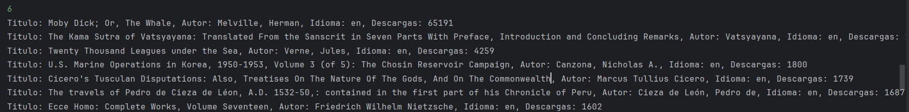

# Literatura
# Challenge-Java

El proyecto tiene como objetivo buscar y mostrar información relevante de libros que estén en local o en el sistema de la api de Gutendex, datos como el nombre del libro, el lenguaje, numero de descargas, los autores y sus respectivas fechas de nacimientos y defunciones.

✔️ Proyecto finalizado, enviar bugs encontrados a contactos ✔️

# Funciones de la aplicación

Las funciones de la aplicación son las siguientes:

## 1. Buscar libro por titulo

Esta función permite buscar un libro por su titulo, se buscaran las coincidencias en la base de datos local, si no se encuentra usara la base de datos de Gutendex para mostrar la información del libro, en caso contrario se mostrará un mensaje de error.

Se puede ver como se usa la función en las siguientes imágenes:

Caso en el cual fue necesario usar la api de Gutendex.

Error generado por no encontrar coincidencias en la base de datos de Gutendex

## 2. Mostrar libros

Se mostraran la totalidad de libros en guardados en la base de datos local, los cuales fueron buscados con anterioridad.

## 3. Mostrar autores

Se mostraran la totalidad de autores en guardados en la base de datos local.

## 4. Mostrar autores por año en el cual seguian vivos

Se buscaran los autores que aun estuvieran vivos para el año ingresado por el usuario, mostrando los autores y sus respectivas fechas de nacimiento y defunción.

## 5. Mostrar idiomas

Se muestran los idiomas de los libros guardados en la base de datos local, con el numero de libros que estan en estos idiomas.

## 6. Mostrar los 10 libros mas descargados

Se muestran los 10 libros mas descargados en la base de datos local.

# Tecnologías utilizadas

* Java 17
* Spring boot v 3.2.5
* Postgresql
* Docker (Opcional)

# Requisitos para ser ejecutado

* Tener acceso a internet
* Tener las variables de entorno configuradas para la conexión a la base de datos:
  * DB_URL=jdbc:postgresql://localhost:5432/challenge_literatura?user\=DB_USER&password\=DB_PASSWORD
      * DB_USER debe ser el mismo usuario que el que tenga la base de datos postgresql
      * DB_PASSWORD debe ser la contraseña del usuario de la base de datos postgresql
      * Si se quiere usar otra base de datos sera necesario readaptar el codigo de resources/application.properties para que se puedan usar jpql y derived queries, no existe codigo sql nativo

## Desarollador del proyecto

Juan Pablo Garcia Carballo

Linkedin www.linkedin.com/in/juan-pablo-garcia-095a62283

[Github](https://github.com/juagarciac)  [Correo](mailto:juanpablogarciacarballo@gmail.com)
